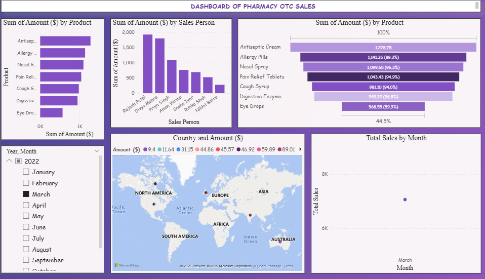

# Pharmacy-OTC-Sales-Analysis

A data analysis project that cleans, processes, and visualizes over-the-counter (OTC) pharmacy sales data. This project helps to understand sales trends, shipment volumes, and revenue patterns, making it easier to derive business insights.

---

## Project Overview

- **Dataset:** PHARMACY OTC SALES  
- **Tools Used:** Python, Pandas, Matplotlib, Seaborn, Jupyter Notebook  
- **Objective:** Clean the dataset, convert columns to correct types, handle missing/invalid data, and create visualizations for insights.  

---

## Steps Performed

1. **Data Cleaning:**
   - Converted column names to lowercase for consistency.
   - Stripped extra spaces in data.
   - Converted `Date` column to `datetime` format.
   - Converted `Boxes Shipped` and `Amount ($)` to numeric types.

2. **Data Analysis & Visualization:**
   - Plotted total boxes shipped over time.
   - Visualized revenue trends.
   - Identified top-selling products and seasonal patterns.

---

## Usage

1. Clone the repository:

```bash
git clone <your-repo-link>
Open the Jupyter Notebook:
```
```bash
Copy code
jupyter notebook Pharmacy_OTC_Sales_Analysis.ipynb
```
Run the notebook to see all analysis and plots.

Dashboard Preview



Notes
Missing or invalid data is handled using errors='coerce' in Pandas.

All numeric and date conversions are applied safely to prevent crashes.

Visualizations help identify trends and make data-driven decisions.

Author
Mohini Pasi


```yaml
Copy code

---

If you want, I can also **write the full Jupyter Notebook code** for this project that reads your CSV, cleans the data, and generates a **dashboard plot** matching the `dashboard.png` image. This way your README and notebook will be ready for GitHub.  

Do you want me to do that?
